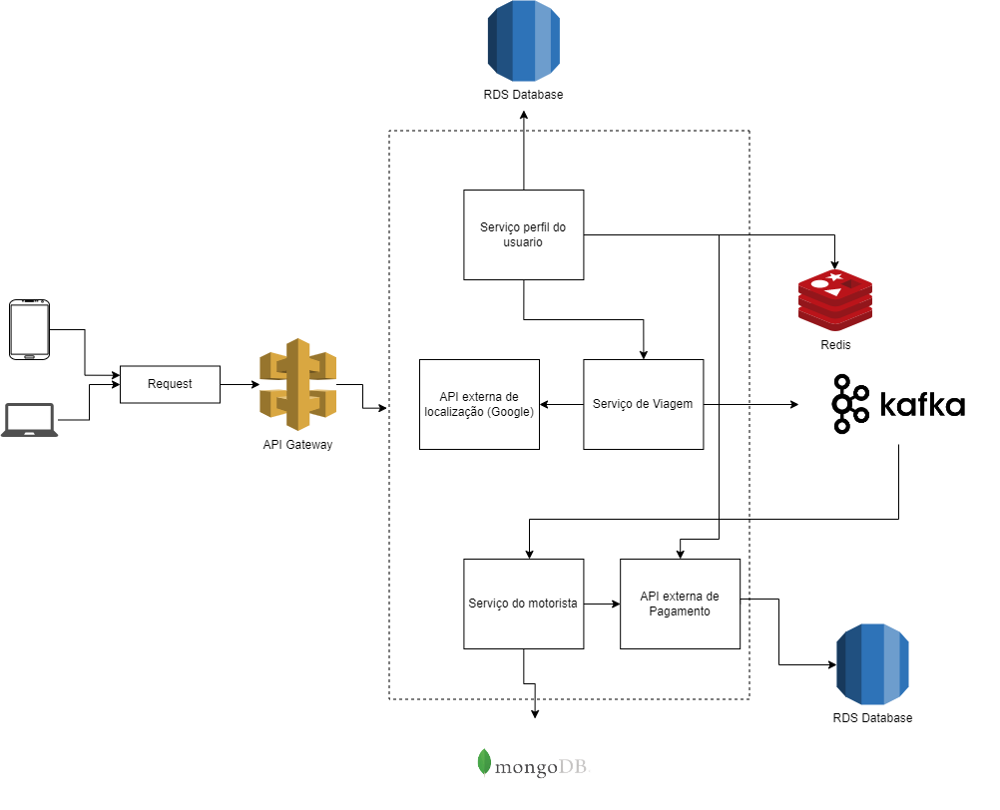
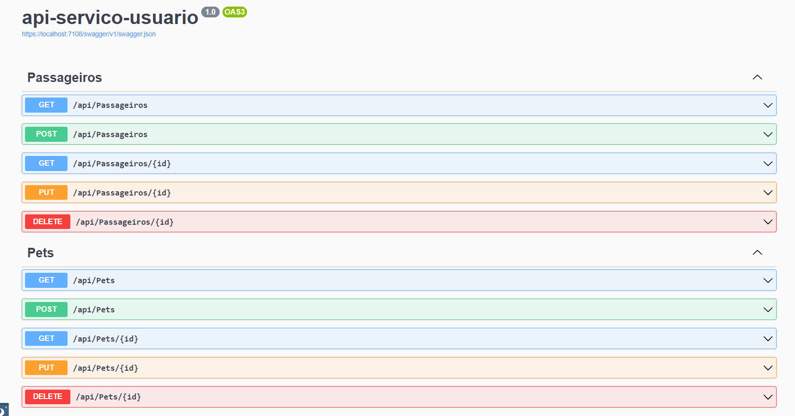
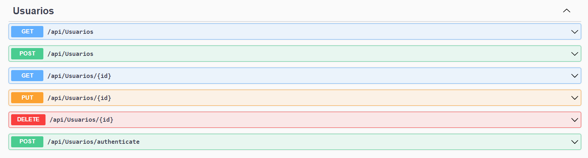
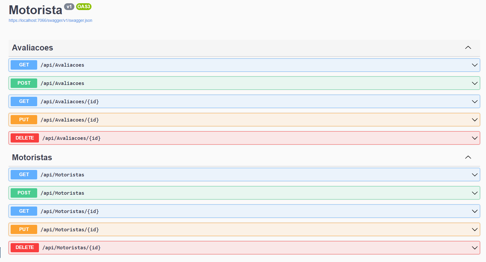
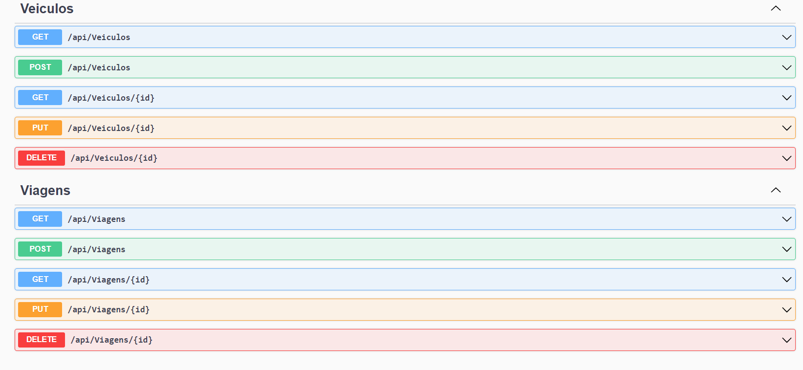

# Arquitetura da Solução

Pré-requisitos: <a href="3-Projeto de Interface.md"> Projeto de Interface</a>

Definição de como o software é estruturado em termos dos componentes que fazem parte da solução e do ambiente de hospedagem da aplicação.

Para o desenvolvimento da solução foi definido o desenvolvimento de 3 APIs:
- Serviço perfil de usuário onde é possível cadastrar novos usuários com seus dados pessoais e seus pets. Assim como é realizada a autenticação dos usuários. Os dados de novos usuários serão armazenados em um banco de dados relacional na nuvem (RDS).  A autenticação é realizada através do JSON Web Token (JWT), depois que o usuário estiver logado, cada solicitação subsequente incluirá o JWT, permitindo que o usuário acesse rotas, serviços e recursos permitidos com esse token.
- Serviço de Viagem onde será possível definir a viagem e para isso será usada uma API externa do google de localização ([Google Maps Platform Documentation  |  Directions API  |  Google Developers](https://developers.google.com/maps/documentation/directions)) . As solicitações de viagens são enviadas para um serviço de mensageria (Kafka) que terá um consumer no serviço de motorista.
- Serviço do motorista onde é possível cadastrar as informações dos motoristas, seu veículos,viagens realizadas e as avaliações atribuídas pelos passageiros. Para salvar as informações dos motoristas foi definido o uso do banco de dados NoSQL MongoDB, esse banco de dados foi escolhido pela ampla quantidade de documentação e por ser orientado a documentação torna viável e rápida a recuperação de informações. Além disso oferece alta disponibilidade e fácil escalabilidade.
- Para os pagamentos uma API externa será utilizada.
Como porta de entrada para os microsserviços foi utilizado um APIGateway. Quando o Cliente chamar um microsserviço estará chamando o APIGateway que direcionara a chamada para o microsserviço apropiado. Nessa solucão foi utilizada a biblioteca Ocelot que permite criar o APIGateway com o ASP.NET (https://ocelot.readthedocs.io/en/latest/features/configuration.html)

## Recursos e Rotas

## Diagrama de Classes

O diagrama de classes ilustra graficamente como será a estrutura do software, e como cada uma das classes da sua estrutura estarão interligadas. Essas classes servem de modelo para materializar os objetos que executarão na memória.

As referências abaixo irão auxiliá-lo na geração do artefato “Diagrama de Classes”.

> - [Diagramas de Classes - Documentação da IBM](https://www.ibm.com/docs/pt-br/rational-soft-arch/9.6.1?topic=diagrams-class)
> - [O que é um diagrama de classe UML? | Lucidchart](https://www.lucidchart.com/pages/pt/o-que-e-diagrama-de-classe-uml)

## Modelo ER

O Modelo ER representa através de um diagrama como as entidades (coisas, objetos) se relacionam entre si na aplicação interativa.]

As referências abaixo irão auxiliá-lo na geração do artefato “Modelo ER”.

> - [Como fazer um diagrama entidade relacionamento | Lucidchart](https://www.lucidchart.com/pages/pt/como-fazer-um-diagrama-entidade-relacionamento)

## Esquema Relacional

O Esquema Relacional corresponde à representação dos dados em tabelas juntamente com as restrições de integridade e chave primária.
 
As referências abaixo irão auxiliá-lo na geração do artefato “Esquema Relacional”.

> - [Criando um modelo relacional - Documentação da IBM](https://www.ibm.com/docs/pt-br/cognos-analytics/10.2.2?topic=designer-creating-relational-model)

## Modelo Físico

Entregar um arquivo banco.sql contendo os scripts de criação das tabelas do banco de dados. Este arquivo deverá ser incluído dentro da pasta src\bd.

## Tecnologias Utilizadas

Para o desenvolvimento dessa aplicação estão sendo utilizadas as seguintes tecnologias:

- C# - Desenvolvimento do Back-end
- React - Front-end
- MongoDB - Banco de dados NoSQL (armazenando dados dos motoristas)
- Visual Studio - IDE
- JWT - Autenticação de usuários 
- Ocelot - APIGateway

## Hospedagem

Explique como a hospedagem e o lançamento da plataforma foi feita.

> **Links Úteis**:
>
> - [Website com GitHub Pages](https://pages.github.com/)
> - [Programação colaborativa com Repl.it](https://repl.it/)
> - [Getting Started with Heroku](https://devcenter.heroku.com/start)
> - [Publicando Seu Site No Heroku](http://pythonclub.com.br/publicando-seu-hello-world-no-heroku.html)

## Qualidade de Software

Conceituar qualidade de fato é uma tarefa complexa, mas ela pode ser vista como um método gerencial que através de procedimentos disseminados por toda a organização, busca garantir um produto final que satisfaça às expectativas dos stakeholders.

No contexto de desenvolvimento de software, qualidade pode ser entendida como um conjunto de características a serem satisfeitas, de modo que o produto de software atenda às necessidades de seus usuários. Entretanto, tal nível de satisfação nem sempre é alcançado de forma espontânea, devendo ser continuamente construído. Assim, a qualidade do produto depende fortemente do seu respectivo processo de desenvolvimento.

A norma internacional ISO/IEC 25010, que é uma atualização da ISO/IEC 9126, define oito características e 30 subcaracterísticas de qualidade para produtos de software.
Com base nessas características e nas respectivas sub-características, identifique as sub-características que sua equipe utilizará como base para nortear o desenvolvimento do projeto de software considerando-se alguns aspectos simples de qualidade. Justifique as subcaracterísticas escolhidas pelo time e elenque as métricas que permitirão a equipe avaliar os objetos de interesse.

> **Links Úteis**:
>
> - [ISO/IEC 25010:2011 - Systems and software engineering — Systems and software Quality Requirements and Evaluation (SQuaRE) — System and software quality models](https://www.iso.org/standard/35733.html/)
> - [Análise sobre a ISO 9126 – NBR 13596](https://www.tiespecialistas.com.br/analise-sobre-iso-9126-nbr-13596/)
> - [Qualidade de Software - Engenharia de Software 29](https://www.devmedia.com.br/qualidade-de-software-engenharia-de-software-29/18209/)
